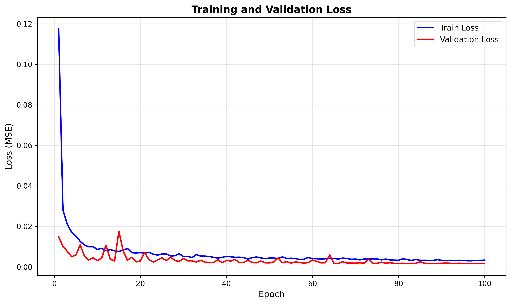
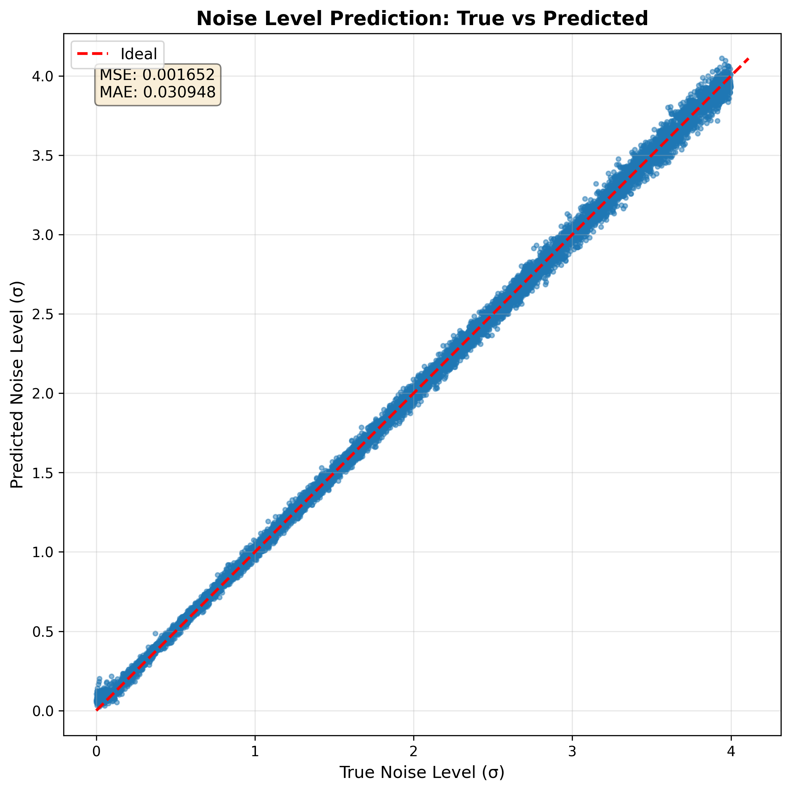
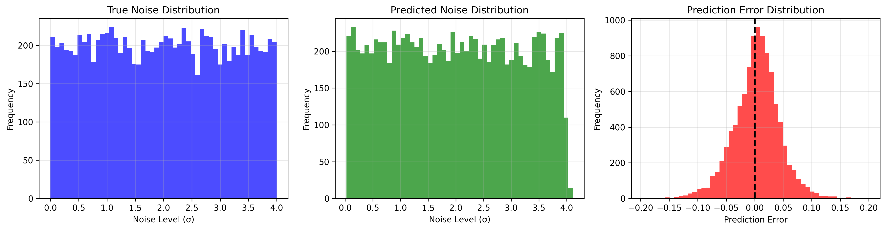
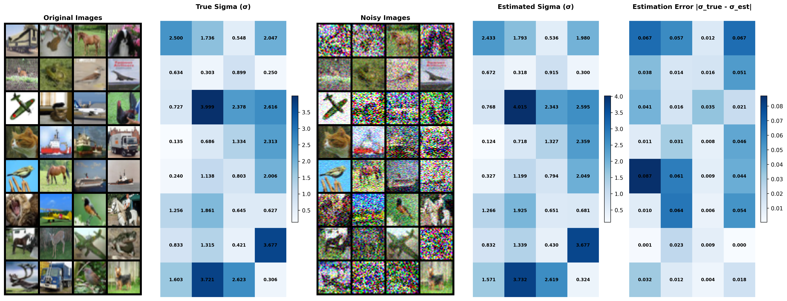

# CIFAR-10 Noise Level Estimation

A deep learning project for estimating noise levels in CIFAR-10 images using ResNet architecture. The model learns to predict the standard deviation (σ) of Gaussian noise added to clean images.

## 📋 Table of Contents

- [Overview](#overview)
- [Features](#features)
- [Project Structure](#project-structure)
- [Installation](#installation)
- [New Unified CLI Interface](#new-unified-cli-interface)
- [Quick Start](#quick-start)
- [Usage](#usage)
  - [Training](#training)
  - [Evaluation](#evaluation)
  - [Configuration](#configuration)
- [Results](#results)
- [Methodology](#methodology)
- [Example Workflow](#example-workflow)
- [Experimental Scenarios](#experimental-scenarios)
- [References](#references)
- [License](#license)
- [Author](#author)
- [Acknowledgments](#acknowledgments)
- [Contributing](#contributing)
- [Support](#support)

## 🎯 Overview

This project implements a noise estimation framework where:
- Clean images from CIFAR-10 are corrupted with Gaussian noise: `x_noise = x + eps * σ`
- `eps ~ N(0, I)` is standard Gaussian noise
- `σ` is uniformly sampled from `[σ_min, σ_max]`
- A ResNet-18 model is trained to predict the noise level `σ` from noisy images

This is a fundamental task in image denoising and is related to diffusion models and score-based generative models.

## ✨ Features

- **Modular Architecture**: Clean, research-oriented codebase with clear separation of concerns
- **Flexible Configuration**: YAML-based configuration with CLI override support
- **Experiment Tracking**: Automatic experiment directory creation with timestamped runs
- **Comprehensive Logging**: Detailed logging of training progress and metrics
- **Rich Visualizations**: Loss curves, prediction scatter plots, noise distributions
- **Checkpoint Management**: Automatic saving of best models and resumable training
- **Unified CLI Interface**: Single main script with train/test subcommands using argparse
- **Reproducibility**: Seed control for reproducible experiments
- **Persian/Farsi Support**: Documentation and CLI help in Persian language

## 📁 Project Structure

```
cifar-noise-estimation/
├── config/
│   └── default.yaml          # Default configuration file
├── src/
│   ├── data/
│   │   ├── __init__.py
│   │   └── dataset.py        # Dataset loading and noise addition
│   ├── models/
│   │   ├── __init__.py
│   │   └── resnet.py         # ResNet architecture
│   ├── training/
│   │   ├── __init__.py
│   │   ├── trainer.py        # Training loop
│   │   └── evaluator.py      # Evaluation logic
│   └── utils/
│       ├── __init__.py
│       ├── config.py         # Configuration management
│       ├── logger.py         # Logging utilities
│       └── visualization.py  # Plotting functions
├── runs/                     # Experiment outputs (auto-generated)
│   └── exp_YYYYMMDD_HHMMSS/
│       ├── config.yaml       # Experiment configuration
│       ├── checkpoints/      # Model checkpoints
│       ├── logs/             # Training logs
│       └── plots/            # Visualization plots
├── main.py                   # Main CLI script (train & test)
├── requirements.txt          # Python dependencies
└── README.md                 # This file
```

## 🚀 Installation


### Setup

1. **Clone the repository**:
```bash
git clone <repository-url>
cd cifar-noise-estimation
```

3. **Install dependencies**:
```bash
pip install -r requirements.txt
```

The CIFAR-10 dataset will be automatically downloaded on first run.

## 🔧 New Unified CLI Interface

Starting from this version, the project uses a single `main.py` script with subcommands instead of separate `train.py` and `test.py` files. This provides:

- **Cleaner interface**: Single entry point for all operations
- **Shared functionality**: Common code is reused between train and test
- **Better organization**: Related commands grouped together
- **Multilingual support**: Help text available in Persian/Farsi

### CLI Structure

```
main.py
├── train    # Training subcommand
└── test     # Testing subcommand
```

## 🎬 Quick Start

### Show Available Commands

```bash
# Show main help
python main.py --help

# Show training options
python main.py train --help

# Show testing options  
python main.py test --help
```

### Train a Model

```bash
# Train with default configuration
python main.py train

# Train with custom parameters
python main.py train --epochs 200 --lr 0.001 --batch-size 128
```

### Evaluate a Model

```bash
# Evaluate the best model from training
python main.py test --checkpoint runs/exp_YYYYMMDD_HHMMSS/checkpoints/best_model.pth
```

## 📖 Usage

### Training

#### Basic Training

```bash
python main.py train --config config/default.yaml
```

#### Training with Custom Parameters

```bash
python main.py train \
    --config config/default.yaml \
    --exp-name my_experiment \
    --epochs 200 \
    --batch-size 128 \
    --lr 0.001 \
    --sigma-min 0.0 \
    --sigma-max 4.0 \
    --device cuda
```

#### Resume Training

```bash
python main.py train \
    --resume \
    --resume-path runs/exp_YYYYMMDD_HHMMSS/checkpoints/latest.pth
```

#### Training Options

| Option | Description | Default |
|--------|-------------|---------|
| `--config` | Path to config file | `config/default.yaml` |
| `--exp-name` | Experiment name prefix | `None` |
| `--epochs` | Number of training epochs | `100` |
| `--batch-size` | Training batch size | `128` |
| `--batch-size-test` | Test batch size | `100` |
| `--lr` | Learning rate | `0.001` |
| `--device` | Device (cuda/cpu) | `cuda` |
| `--seed` | Random seed | `42` |
| `--sigma-min` | Min noise std | `0.0` |
| `--sigma-max` | Max noise std | `4.0` |
| `--resume` | Resume from checkpoint | `False` |
| `--resume-path` | Path to checkpoint | `None` |

### Evaluation

#### Basic Evaluation

```bash
python main.py test --checkpoint path/to/checkpoint.pth
```

#### Evaluation with Options

```bash
python main.py test \
    --checkpoint runs/exp_YYYYMMDD_HHMMSS/checkpoints/best_model.pth \
    --config config/default.yaml \
    --exp-name test_experiment \
    --batch-size 100 \
    --evaluate-by-noise-level
```

#### Evaluation Options

| Option | Description | Default |
|--------|-------------|---------|
| `--checkpoint` | Path to model checkpoint | **Required** |
| `--config` | Path to config file | `config/default.yaml` |
| `--exp-name` | Experiment name for results | `test` |
| `--batch-size` | Test batch size | `100` |
| `--device` | Device (cuda/cpu) | `cuda` |
| `--sigma-min` | Min noise std for testing | `0.0` |
| `--sigma-max` | Max noise std for testing | `4.0` |
| `--save-visualizations` | Save plots | `True` |
| `--evaluate-by-noise-level` | Per-level metrics | `False` |

### Configuration

#### YAML Configuration File

Create custom configuration files in the `config/` directory:

```yaml
# config/custom.yaml
model:
  name: "ResNet18"
  num_classes: 1

data:
  batch_size_train: 256
  batch_size_test: 100
  num_workers: 4

noise:
  sigma_min: 0.0
  sigma_max: 2.0

training:
  epochs: 200
  learning_rate: 0.0005
  optimizer: "SGD"
  scheduler: "CosineAnnealingLR"
```

#### CLI Override

CLI arguments take precedence over config file values:

```bash
# Config file has lr=0.001, but CLI overrides it to 0.0005
python main.py train --config config/default.yaml --lr 0.0005
```

The final configuration (after CLI override) is saved in the experiment directory.

## 📊 Results

This section presents the experimental results obtained from training and evaluating the noise estimation model on CIFAR-10 dataset.

### Experimental Setup

The model was trained with the following configuration (as specified in `config/default.yaml`):

- **Model Architecture**: ResNet-18
- **Training Epochs**: 100
- **Learning Rate**: 0.001
- **Batch Size**: 128 (training), 100 (testing)
- **Noise Range**: σ ∈ [0.0, 4.0]
- **Optimizer**: SGD with momentum (0.9)
- **Scheduler**: Cosine Annealing LR
- **Loss Function**: Mean Squared Error (MSE)
- **Dataset**: CIFAR-10 (10,000 test samples)

### Training Results

The model was trained for 100 epochs, achieving convergence with stable training and validation losses. The training process shows consistent learning with the best validation loss of **0.001595** achieved at epoch 99.



**Figure 1**: Training and validation loss curves over 100 epochs. The model shows stable convergence with both training and validation losses decreasing consistently, indicating good generalization without overfitting.

**Key Training Observations**:
- Initial training loss: 0.1174 (epoch 0)
- Final training loss: 0.0032 (epoch 99)
- Best validation loss: 0.0016 (epoch 99)
- The model demonstrates stable convergence with no signs of overfitting
- Training and validation losses follow similar trends, indicating good generalization

### Test Results

The trained model was evaluated on the CIFAR-10 test set (10,000 samples) with noise levels uniformly sampled from [0.0, 4.0]. The evaluation demonstrates excellent performance across all metrics.

#### Overall Performance Metrics

| Metric | Value |
|--------|-------|
| **MSE** (Mean Squared Error) | 0.00165 |
| **RMSE** (Root Mean Squared Error) | 0.0406 |
| **MAE** (Mean Absolute Error) | 0.0309 |
| **R² Score** | 0.9988 |
| **Pearson Correlation** | 0.9994 |
| **Mean Error (Bias)** | 0.0035 |
| **Median Absolute Error** | 0.0244 |
| **Max Absolute Error** | 0.2002 |
| **Std Error** | 0.0405 |

**Key Findings**:
- **Excellent predictive accuracy**: R² score of 0.9988 indicates that the model explains 99.88% of the variance in noise levels
- **Strong linear correlation**: Pearson correlation coefficient of 0.9994 demonstrates nearly perfect linear relationship between predicted and true noise levels
- **Low prediction error**: Mean absolute error of 0.0309 on a scale of [0.0, 4.0] represents less than 1% relative error
- **Minimal bias**: Mean error of 0.0035 indicates the model has very little systematic bias

#### Visualization Results



**Figure 2**: Scatter plot showing the relationship between true noise levels (σ_true) and predicted noise levels (σ_pred) for 10,000 test samples. The points closely align with the diagonal line (y=x), indicating highly accurate predictions across the entire noise range [0.0, 4.0].



**Figure 3**: Distribution analysis of true and predicted noise levels. The histogram and kernel density estimates show that the model accurately captures the uniform distribution of noise levels in the test set, with predicted values closely matching the true distribution.



**Figure 4**: Detailed noise estimation table showing sample predictions for 32 test images. Each row displays the clean image, noisy image, true noise level (σ), predicted noise level (σ_pred), and absolute error. The table demonstrates the model's ability to accurately estimate noise levels across different image content and noise magnitudes.

#### Performance by Noise Level

The model's performance was analyzed across different noise level ranges to assess consistency:

| Noise Range (σ) | Samples | MAE | MSE |
|----------------|---------|-----|-----|
| [0.0, 0.4] | 949 | 0.0250 | 0.0011 |
| [0.4, 0.8] | 1,049 | 0.0184 | 0.0005 |
| [0.8, 1.2] | 970 | 0.0200 | 0.0006 |
| [1.2, 1.6] | 1,016 | 0.0228 | 0.0008 |
| [1.6, 2.0] | 1,005 | 0.0258 | 0.0010 |
| [2.0, 2.4] | 982 | 0.0295 | 0.0014 |
| [2.4, 2.8] | 987 | 0.0350 | 0.0019 |
| [2.8, 3.2] | 1,040 | 0.0380 | 0.0022 |
| [3.2, 3.6] | 1,039 | 0.0427 | 0.0029 |
| [3.6, 4.0] | 963 | 0.0458 | 0.0033 |

**Analysis**:
- The model maintains high accuracy across all noise levels
- Performance is slightly better for moderate noise levels (0.4-1.2) with MAE around 0.018-0.020
- Error increases slightly for very high noise levels (3.2-4.0), which is expected as noise estimation becomes more challenging with extreme corruption
- The consistent performance across the full range [0.0, 4.0] demonstrates the model's robustness

### Experimental Output Structure

Each training run creates an experiment directory:

```
runs/exp_YYYYMMDD_HHMMSS/
├── config.yaml              # Final configuration used
├── checkpoints/
│   ├── best_model.pth       # Best model (lowest val loss)
│   ├── latest.pth           # Latest checkpoint (for resuming)
│   └── checkpoint_epoch_*.pth  # Periodic checkpoints
├── logs/
│   ├── train.log            # Detailed training logs
│   └── metrics.json         # Training metrics (JSON)
└── plots/
    └── loss_curve.png       # Training/validation loss
```

Each evaluation run creates a test directory:

```
runs/test_YYYYMMDD_HHMMSS/
├── config.yaml              # Test configuration
├── logs/
│   ├── test.log             # Evaluation logs
│   └── test_metrics.json    # Detailed metrics
└── plots/
    ├── test_scatter_predictions.png    # True vs Predicted σ
    ├── test_noise_distribution.png     # Noise distributions
    ├── test_sample_images.png          # Sample clean/noisy images
    └── noise_estimation_table.png      # Detailed prediction table
```

## 🔬 Methodology

### Problem Formulation

Given a clean image `x`, we add Gaussian noise:

```
x_noisy = x + ε * σ
```

where:
- `ε ~ N(0, I)`: Standard Gaussian noise
- `σ ~ Uniform(σ_min, σ_max)`: Noise standard deviation

The model `f_θ` learns to predict `σ`:

```
σ_pred = f_θ(x_noisy)
```

### Training Process

1. **Data Loading**: CIFAR-10 images are loaded and normalized
2. **Noise Addition**: For each batch, random noise levels are sampled and noise is added
3. **Forward Pass**: Noisy images pass through ResNet-18
4. **Loss Computation**: MSE loss between predicted and true σ
5. **Backpropagation**: Gradient descent to update model weights

**Key Design Choice**: Noise is added **dynamically during training**, not pre-computed. This ensures:
- Different noise patterns in each epoch
- Better generalization
- More robust noise estimation

### Model Architecture

- **Base Model**: ResNet-18
- **Input**: Noisy RGB images (3×32×32)
- **Output**: Single scalar value (predicted σ)
- **Loss Function**: Mean Squared Error (MSE)
- **Optimizer**: SGD with momentum
- **Scheduler**: Cosine Annealing LR

## 📝 Example Workflow

### Complete Training and Evaluation

```bash
# 1. Train a model
python main.py train \
    --exp-name noise_estimation_v1 \
    --epochs 100 \
    --lr 0.001 \
    --sigma-min 0.0 \
    --sigma-max 4.0

# 2. Evaluate the trained model
python main.py test \
    --checkpoint runs/noise_estimation_v1_20241026_143022/checkpoints/best_model.pth \
    --exp-name evaluation_v1 \
    --evaluate-by-noise-level

# 3. Check results
ls runs/evaluation_v1_*/plots/
```

### Experiment with Different Noise Ranges

```bash
# Train on low noise
python main.py train --exp-name low_noise --sigma-min 0.0 --sigma-max 0.5 --epochs 100

# Train on high noise
python main.py train --exp-name high_noise --sigma-min 0.5 --sigma-max 2.0 --epochs 100

# Train on full range
python main.py train --exp-name full_range --sigma-min 0.0 --sigma-max 4.0 --epochs 150

# Evaluate all three models
python main.py test --checkpoint runs/low_noise_*/checkpoints/best_model.pth --exp-name eval_low
python main.py test --checkpoint runs/high_noise_*/checkpoints/best_model.pth --exp-name eval_high
python main.py test --checkpoint runs/full_range_*/checkpoints/best_model.pth --exp-name eval_full
```

## 🧪 Experimental Scenarios

### Experiment 1: Hyperparameter Tuning - Learning Rate

```bash
# Test different learning rates
python main.py train --exp-name lr_0001 --lr 0.001 --epochs 50
python main.py train --exp-name lr_0005 --lr 0.005 --epochs 50
python main.py train --exp-name lr_00001 --lr 0.0001 --epochs 50
```

### Experiment 2: Batch Size Comparison

```bash
# Test different batch sizes
python main.py train --exp-name bs_64 --batch-size 64 --epochs 50
python main.py train --exp-name bs_128 --batch-size 128 --epochs 50
python main.py train --exp-name bs_256 --batch-size 256 --epochs 50
```

### Experiment 3: Noise Range Comparison

```bash
# Small range
python main.py train --exp-name sigma_0_05 --sigma-min 0.0 --sigma-max 0.5 --epochs 100

# Medium range
python main.py train --exp-name sigma_0_10 --sigma-min 0.0 --sigma-max 1.0 --epochs 100

# Large range
python main.py train --exp-name sigma_0_20 --sigma-min 0.0 --sigma-max 2.0 --epochs 100

# Evaluate all three models with detailed analysis
python main.py test --checkpoint runs/sigma_0_05_*/checkpoints/best_model.pth --exp-name eval_0_05 --evaluate-by-noise-level
python main.py test --checkpoint runs/sigma_0_10_*/checkpoints/best_model.pth --exp-name eval_0_10 --evaluate-by-noise-level
python main.py test --checkpoint runs/sigma_0_20_*/checkpoints/best_model.pth --exp-name eval_0_20 --evaluate-by-noise-level
```

## 📚 References

- He, K., Zhang, X., Ren, S., & Sun, J. (2016). Deep Residual Learning for Image Recognition. CVPR 2016.
- Krizhevsky, A. (2009). Learning Multiple Layers of Features from Tiny Images. Technical Report.

## 📄 License

This project is free and open source, available for anyone to use, modify, and distribute. It is provided as-is for research, educational, and commercial purposes without any restrictions.

**MIT License** - Feel free to use this code in your own projects!

## 👤 Author

**Mehdi Dehghani**
- GitHub: [@mehdeh](https://github.com/mehdeh)
- Project: [cifar-noise-estimation](https://github.com/mehdeh/cifar-noise-estimation)

## 🙏 Acknowledgments

- CIFAR-10 dataset by Alex Krizhevsky
- ResNet architecture by Kaiming He et al.
- PyTorch team for the deep learning framework
- The open-source community for inspiration and best practices

## 🤝 Contributing

Contributions, issues, and feature requests are welcome! Feel free to check the [issues page](https://github.com/mehdeh/cifar-noise-estimation/issues) or submit a pull request.

## ⭐ Support

If you find this project helpful for your research or work, please consider giving it a star on GitHub!

---

**Note**: This is a research-oriented project developed for educational and research purposes. For production use, additional optimization and validation may be required.

